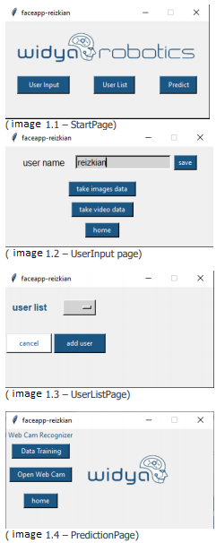
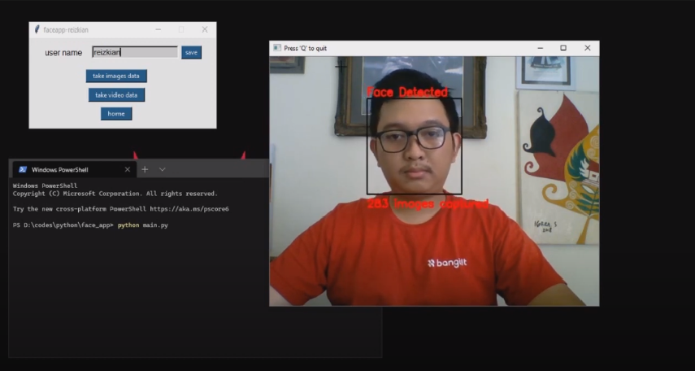
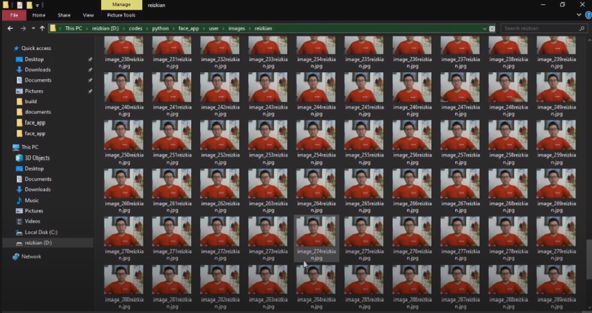
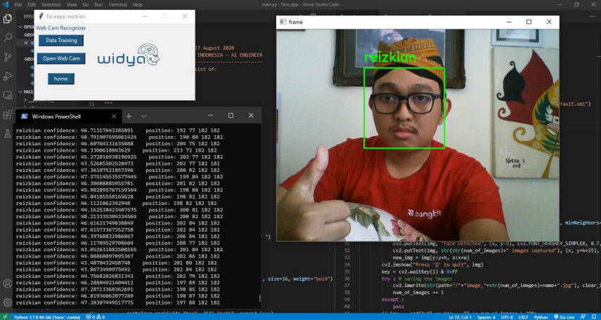

# FaceRecognition-Widya

This project were created to fulfill the AI Engineer assesment test at PT.Widya Inovasi. The software that I build were using two main python library which are TKinter for simple user interface and OpenCV for face recognition functionallity.

youtube demo : https://www.youtube.com/watch?v=Wva7UTVvia8&t=153s&ab_channel=ReizkianYesaya

## Source Code
### 1. main.py (simple user interface)
main.py include four basic user interface functionallity which are take user name, user photo images, and video.

(image 1.5 - take dataset)

(image 1.6 - folder dataset)

### 2. train.py
tain images dataset from directory:
1) OS walk searching for images
2) transform images data to tensor array, folder names as label (x_train,y_label)
3) save label dictionarry
4) train recognizer (LBPH face recognizer)
5) save recognize xml

### 3. predict.py
open webcam to predict face based on stored face images data.

